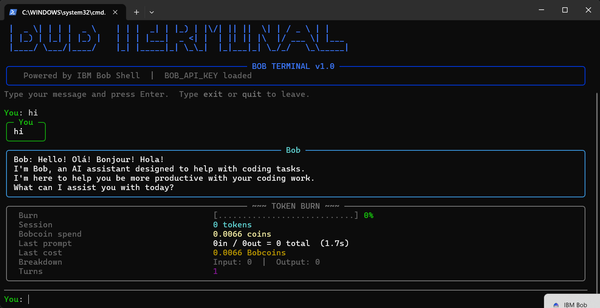

# BobBurn 🔥

> *Watch your Bobcoins burn, one prompt at a time.*

Real-time Bobcoin metering for IBM Bob in your terminal — chat with Bob,
see exactly what each prompt costs, and track your session burn live.

## Screenshot



## Features

- Connects to IBM Bob through Bob Shell CLI (`bob run --format stream-json`)
- Live **TOKEN BURN** dashboard after every reply
- Tracks **Bobcoins** spent per prompt and session total
- Shows input/output token counts and response duration
- Visual burn meter that turns yellow at 50% and red at 80%
- Multi-turn conversation context via Bob Shell session
- Clean Rich-powered UI — coloured panels, spinner, ASCII header

## Requirements

- Python 3.9+
- An IBM Bob **Inference** API key — get one at [bob.ibm.com/admin/api-keys](https://bob.ibm.com/admin/api-keys)

## Setup

The installer handles Bob Shell + Python deps in one step.

**Windows (PowerShell):**
```powershell
.\install.ps1
```

**macOS / Linux:**
```bash
chmod +x install.sh && ./install.sh
```

**Manual setup:**
```bash
# 1. Install Bob Shell
powershell -c "irm https://bob.ibm.com/download/bobshell.ps1 | iex"  # Windows
curl -fsSL https://bob.ibm.com/download/bobshell.sh | bash            # macOS/Linux

# 2. Install Python dependencies
pip install -r requirements.txt
```

## Usage

```powershell
# Windows
$env:BOB_API_KEY="bob_prod_bob-apikey_..."
py bob_terminal.py

# macOS/Linux
export BOB_API_KEY="bob_prod_bob-apikey_..."
python bob_terminal.py
```

Type a message and press **Enter**. Type `exit` or `quit` to leave.

## Token Burn Dashboard

After every reply you will see a live panel like:

```
+------------------------- ~~~ TOKEN BURN ~~~ -------------------------+
|  Burn            [...........................] 0%                     |
|  Session         0 tokens                                            |
|  Bobcoin spend   0.0066 coins                                        |
|  Last prompt     0in / 0out = 0 total  (1.7s)                       |
|  Last cost       0.0066 Bobcoins                                     |
|  Breakdown       Input: 0  |  Output: 0                              |
|  Turns           1                                                   |
+----------------------------------------------------------------------+
```

The burn meter fills as tokens accumulate across the session (cap: 50,000 tokens).
Bobcoin spend tracks your real IBM Bob billing consumption.

## Environment Variables

| Variable | Description |
|---|---|
| `BOB_API_KEY` | **Required.** Your IBM Bob Inference API key |
| `BOB_TEAM_ID` | Optional. Team ID (only needed for General-scope keys) |
| `BOB_CMD` | Optional. Full path to `bob` binary if not auto-detected |
